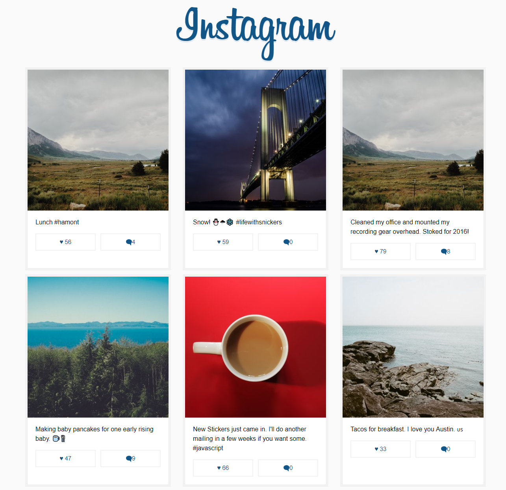

1. A mock of Instagram.  
2. Implememted using React-Redux.  
3. Used React-router for routing between home page and specific post.  
4. Used stylus npm package for animation around whole application. 

